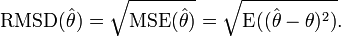
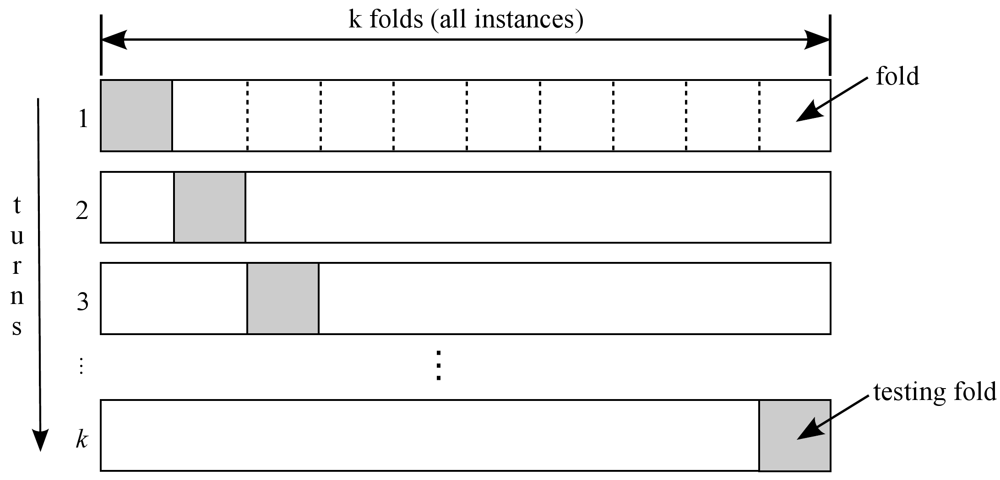

## Part 1: One-fold Cross Validation

This morning you will learn how to use cross validation to evaluate your model.
The goal for this morning is not to try to build a perfect model, as you
tried to do yesterday. The goal is to evaluate the model given some metric you are
interested in.

**Note: Use ipython notebook to prototype your code.**
      **Put the code in** `cross_val.py` **afterwards for submission.**

<br>

1. Include the following lines to import the libraries needed:

   ```python
   from sklearn.linear_model import LinearRegression
   from sklearn.cross_validation import KFold
   from sklearn.cross_validation import train_test_split
   from sklearn.cross_validation import cross_val_score
   import numpy as np
   from sklearn.datasets import load_boston
   ```

2. Load in the boston data with the following commands.

   ```python
   boston = load_boston()
   features = boston.data
   house_price = boston.target
   ```

   Descriptions for each column in `features`:

   ```
   Attribute Information (in order):
    - CRIM     per capita crime rate by town
    - ZN       proportion of residential land zoned for lots over 25,000 sq.ft.
    - INDUS    proportion of non-retail business acres per town
    - CHAS     Charles River dummy variable (= 1 if tract bounds river; 0 otherwise)
    - NOX      nitric oxides concentration (parts per 10 million)
    - RM       average number of rooms per dwelling
    - AGE      proportion of owner-occupied units built prior to 1940
    - DIS      weighted distances to five Boston employment centres
    - RAD      index of accessibility to radial highways
    - TAX      full-value property-tax rate per $10,000
    - PTRATIO  pupil-teacher ratio by town
    - B        1000(Bk - 0.63)^2 where Bk is the proportion of blacks by town
    - LSTAT    % lower status of the population
    - MEDV     Median value of owner-occupied homes in $1000's
   ```

3. Use `train_test_split()` in scikit learn to make a test and training dataset.
   The training-test split is usually 70 : 30.

   ```python
   train_feature, test_feature, train_target, test_target = \
   train_test_split(features, target, test_size=0.3)
   ```

3. Use `LinearRegression()` in scikit-learn to build a model which uses the
   `features` to predict `target`. Only fit the model using the training data set.

   Note that there is multicollinarity and other issues in the data.  Do not
   worry about this. We will learn about Lasso and Ridge regularization this
   afternoon (alternative to the methods you have learned yesterday) to
   deal with those issues.

   ```python
   linear = LinearRegression()
   linear.fit(train_feature, train_target)
   # You can call predict to get the predicted values for training and test
   train_predicted = linear.predict(train_feature)
   test_predicted = linear.predict(test_feature)
   ```

4. Write a function that takes the `target` and the `predicted` and calculate
   the **RMSE for the training data and the test data**. Use
   `sklearn.metrics.mean_squared_error()` to confirm your results.

   <div align="center">
    
   </div>

   Which did you expect to be higher?

5. Explain the value of evaluating RMSE on a separate test set (instead of fitting a
   model and calculating RMSE on the entire data set).

## Part 2: K-fold Cross Validation

In K-fold cross validation, the data is split into **k** groups. One group
out of the k groups will be the test set, the rest (**k-1**) groups will
be the training set. In the next iteration, another group will be the test set,
and the rest will be the training set. The process repeats for k iterations (k-fold).
In each fold, a metric for accuracy (RMSE in this case) will be calculated and
an overall average of that metric will be calculated over k-folds.

<div align="center">
    
</div>

<br>

Here we will implement K-fold validation **on the training dataset**.
`sklearn` has its own implementation of K-fold
(`sklearn.cross_validation_cross_val_score()`).
However, to ensure you have an understanding of K-fold, you will implement it
here.

<br>

1. To do this you need to manage randomly sampling **k** folds.

2. Properly combining those **k** folds into a test and training set on
   your **on the training dataset**. Outside of the k-fold, there should be
   another test set which will be referred to as the **hold-out set**.

3. Train your model on your constructed training set and evaluate on the given test set

3. Repeat step __ii__ and __iii__ _k_ times.

4. Average your results of your error metric.

5. Compare the RMSE for your hold-out set and K-fold cross validation.

6. Plot a learning curve and test vs training error curve.
   (You might want to use: [cross_val_score](http://scikit-learn.org/stable/modules/generated/sklearn.cross_validation.cross_val_score.html) which is scikit-learn's built-in
   function for K-fold cross validation).


### Part 3: Stepwise Regression (Extra Credit)

While stepwise regression has its many [critics](http://andrewgelman.com/2014/06/02/hate-stepwise-regression/), it is a useful exercise to introduce the concept of feature selection in the context of linear regression. This extra credit exercise has two components of different difficulties. First, use the `scikit-learn` reverse feature elimation (a greedy feature elimination algorithm) to implement something similar to sequential backward selection. The second, more difficult part is implementing sequential forward selection.

1. Generate a series of of `n=5000` samples, `n=100` features, with a `random_seed=0` using the `make_friedman1` dataset like so:

```python
from sklearn.datasets import make_friedman1
X, y = make_friedman1(n_samples=5000, n_features=100, random_state=0)
```

2. Now, create a `LinearRegression()` object and pass it into the [RFE](http://scikit-learn.org/stable/modules/generated/sklearn.feature_selection.RFE.html) selection algorithm.
3. Using a `for` loop, generate a series of models that take the top `n` features and calculate the `R^2` score using the `.score()` method.
4. Plot the `R^2` as a function of the number of included features. What does this plot tell you about the number of useful features in your model?
5. Extra extra credit. Instead of using RFE to do backward selection, create your own `LinearRegression` class that implements sequential forward selection, which involves starting with no variables in the model, testing the addition of each variable using a chosen model comparison criterion, adding the variable (if any) that improves the model the most, and repeating this process until none improves the model.

#### Reference

* [Stepwise Regression Procedure](https://onlinecourses.science.psu.edu/stat501/node/88)
