# Introduction to `Scikit-learn`

The `scikit-learn` package is an open-source library that provides a robust set
of machine learning algorithms for Python. It is built upon the core Python
scientific stack (*i.e.* NumPy, SciPy, Cython), and has a simple, consistent
API, making it useful for a wide range of statistical learning applications.


## What is Machine Learning?

Machine Learning (ML) is about coding programs that automatically adjust their
performance from exposure to information encoded in data. This learning is
achieved via **tunable parameters** that are automatically adjusted according to
performance criteria.

Machine Learning can be considered a subfield of Artificial Intelligence (AI).

There are three major classes of ML:

**Supervised learning**
: Algorithms which learn from a training set of *labeled* examples (exemplars)
to generalize to the set of all possible inputs. Examples of supervised learning
include regression and support vector machines.

**Unsupervised learning**
: Algorithms which learn from a training set of *unlableled* examples, using the
features of the inputs to categorize inputs together according to some
statistical criteria. Examples of unsupervised learning include k-means
clustering and kernel density estimation.

**Reinforcement learning**
: Algorithms that learn via reinforcement from a *critic* that provides
information on the quality of a solution, but not on how to improve it. Improved
solutions are achieved by iteratively exploring the solution space. We will not
cover RL in this course.

## Representing Data in `scikit-learn`

Most machine learning algorithms implemented in scikit-learn expect data to be
stored in a
**two-dimensional array or matrix**.  The arrays can be
either ``numpy`` arrays, or in some cases ``scipy.sparse`` matrices.
The size of the array is expected to be `[n_samples, n_features]`

- **n_samples:**   The number of samples: each sample is an item to process
(e.g. classify).
  A sample can be a document, a picture, a sound, a video, an astronomical
object,
  a row in database or CSV file,
  or whatever you can describe with a fixed set of quantitative traits.
- **n_features:**  The number of features or distinct traits that can be used to
describe each
  item in a quantitative manner.  Features are generally real-valued, but may be
boolean or
  discrete-valued in some cases.

The number of features must be fixed in advance. However it can be very high
dimensional
(e.g. millions of features) with most of them being zeros for a given sample.
This is a case
where `scipy.sparse` matrices can be useful, in that they are
much more memory-efficient than numpy arrays.

# Example: Iris morphometrics

One of the datasets included with `scikit-learn` is a set of measurements for
flowers, each being a member of one of three species: *Iris Setosa*, *Iris
Versicolor* or *Iris Virginica*.


```python
from sklearn.datasets import load_iris
import matplotlib.pyplot as plt
%pylab inline
iris = load_iris??
```

    Populating the interactive namespace from numpy and matplotlib


```python
iris = load_iris()
```


```python
iris.keys()
```


    ['target_names', 'data', 'target', 'DESCR', 'feature_names']


```python
n_samples, n_features = iris.data.shape
n_samples, n_features
```


    (150, 4)


```python
iris.feature_names
```


    ['sepal length (cm)',
     'sepal width (cm)',
     'petal length (cm)',
     'petal width (cm)']


```python
iris.data
```


    array([[ 5.1,  3.5,  1.4,  0.2],
           [ 4.9,  3. ,  1.4,  0.2],
           [ 4.7,  3.2,  1.3,  0.2],
           [ 4.6,  3.1,  1.5,  0.2],
           [ 5. ,  3.6,  1.4,  0.2],
           [ 5.4,  3.9,  1.7,  0.4],
           [ 4.6,  3.4,  1.4,  0.3],
			...]


```python
iris.target
```


    array([0, 0, 0, 0, 0, 0, 0, 0, 0, 0, 0, 0, 0, 0, 0, 0, 0, 0, 0, 0, 0, 0, 0,
           0, 0, 0, 0, 0, 0, 0, 0, 0, 0, 0, 0, 0, 0, 0, 0, 0, 0, 0, 0, 0, 0, 0,
           0, 0, 0, 0, 1, 1, 1, 1, 1, 1, 1, 1, 1, 1, 1, 1, 1, 1, 1, 1, 1, 1, 1,
           1, 1, 1, 1, 1, 1, 1, 1, 1, 1, 1, 1, 1, 1, 1, 1, 1, 1, 1, 1, 1, 1, 1,
           1, 1, 1, 1, 1, 1, 1, 1, 2, 2, 2, 2, 2, 2, 2, 2, 2, 2, 2, 2, 2, 2, 2,
           2, 2, 2, 2, 2, 2, 2, 2, 2, 2, 2, 2, 2, 2, 2, 2, 2, 2, 2, 2, 2, 2, 2,
           2, 2, 2, 2, 2, 2, 2, 2, 2, 2, 2, 2])


```python
iris.target_names
```


    array(['setosa', 'versicolor', 'virginica'], 
          dtype='|S10')


```python
x_index = 0
y_index = 1
# this formatter will label the colorbar with the correct target names
formatter = plt.FuncFormatter(lambda i, *args: iris.target_names[int(i)])
plt.scatter(iris.data[:, x_index], iris.data[:, y_index], c=iris.target)
plt.colorbar(ticks=[0, 1, 2], format=formatter)
plt.xlabel(iris.feature_names[x_index])
plt.ylabel(iris.feature_names[y_index])
```


    <matplotlib.text.Text at 0x1099ce790>


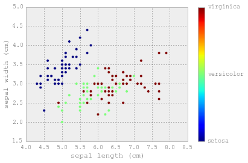


```python
iris_X = iris.data
iris_y = iris.target

import pandas as pd

aa = pd.DataFrame([1,2,3])

aa.as_matrix()

np.random.seed(0)
indices = np.random.permutation(len(iris_X))
iris_X_train = iris_X[indices[:-10]]
iris_y_train = iris_y[indices[:-10]]
iris_X_test  = iris_X[indices[-10:]]
iris_y_test  = iris_y[indices[-10:]]

# Create and fit a nearest-neighbor classifier
from sklearn.neighbors import KNeighborsClassifier
knn = KNeighborsClassifier(n_neighbors=4)

print knn.fit(iris_X_train, iris_y_train).score(iris_X_test, iris_y_test)

#KNeighborsClassifier(algorithm='auto', leaf_size=30, metric='minkowski',
#           n_neighbors=5, p=2, weights='uniform')

#print knn.predict(iris_X_test)

print iris_y_test

```

## `scikit-learn` interface

All objects within scikit-learn share a uniform common basic API consisting of
three complementary interfaces: an **estimator** interface for building and
fitting models, a **predictor** interface for making predictions and a
**transformer** interface for converting data.

The estimator interface is at the core of the library. It defines instantiation
mechanisms of objects and exposes a fit method for learning a model from
training data. All supervised and unsupervised learning algorithms (*e.g.*, for
classification, regression or clustering) are offered as objects implementing this
interface. Machine learning tasks like feature extraction, feature selection or
dimensionality reduction are also provided as estimators.

Scikit-learn strives to have a uniform interface across all methods; given a
scikit-learn *estimator*
object named `model`, the following methods are available:

- Available in **all Estimators**
  + `model.fit()` : fit training data. For supervised learning applications,
    this accepts two arguments: the data `X` and the labels `y` (e.g.
`model.fit(X, y)`).
    For unsupervised learning applications, this accepts only a single argument,
    the data `X` (e.g. `model.fit(X)`).
- Available in **supervised estimators**
  + `model.predict()` : given a trained model, predict the label of a new set of
data.
    This method accepts one argument, the new data `X_new` (e.g.
`model.predict(X_new)`),
    and returns the learned label for each object in the array.
  + `model.predict_proba()` : For classification problems, some estimators also
provide
    this method, which returns the probability that a new observation has each
categorical label.
    In this case, the label with the highest probability is returned by
`model.predict()`.
  + `model.score()` : for classification or regression problems, most (all?)
estimators implement
    a score method.  Scores are between 0 and 1, with a larger score indicating
a better fit.
- Available in **unsupervised estimators**
  + `model.transform()` : given an unsupervised model, transform new data into
the new basis.
    This also accepts one argument `X_new`, and returns the new representation
of the data based
    on the unsupervised model.
  + `model.fit_transform()` : some estimators implement this method,
    which more efficiently performs a fit and a transform on the same input
data.

The *predictor* interface extends the notion of an estimator by adding a
`predict` method that takes an array `X_test` and produces predictions based on
the learned parameters of the estimator. In the case of supervised learning
estimators, this method typically returns the predicted labels or values
computed by the model. Some unsupervised learning estimators may also implement
the predict interface, such as k-means, where the predicted values are the
cluster labels.

Since it is common to modify or filter data before feeding it to a learning
algorithm, some estimators in the library implement a *transformer* interface
which defines a transform method. It takes as input some new data `X_test` and
yields as output a transformed version. Preprocessing, feature selection,
feature extraction and dimensionality reduction algorithms are all provided as
transformers within the library.

###First, a bit about scikit-learn

The structure of scikit-learn:

Some of the following text is taken from the scikit-learn API paper:
http://arxiv.org/pdf/1309.0238v1.pdf

>All objects within scikit-learn share a uniform common basic API consisting of
three complementary interfaces: an estimator interface for building and fitting
models, a predictor interface for making predictions and a transformer interface
for converting data.

>The estimator interface is at the core of the library. It defines instantiation
mechanisms of objects and exposes a ***fit*** method for learning a model from
training data. All supervised and unsupervised learning algorithms (e.g., for
classification, regression or clustering) are offered as objects implementing this
interface. Machine learning tasks like feature extraction, feature selection or
dimensionality reduction are also provided as estimators.


An example along these lines:

    clf = LogisticRegression()
    clf.fit(X_train, y_train)

If one changes classifiers, say, to a Random Forest classifier, one would simply
replace `LogisticRegression()` in the snippet above by
`RandomForestClassifier()`.

>The **predictor** interface extends the notion of an estimator by adding a
predict
method that takes an array `X_test` and produces predictions for `X_test`, based
on
the learned parameters of the estimator. In the case of
supervised learning estimators, this method typically returns the predicted
labels or values computed by the model. Some unsupervised learning estimators
may also implement the predict interface, such as k-means, where the predicted
values are the cluster labels.

    clf.predict(X_test)

>Since it is common to modify or filter data before feeding it to a learning
algorithm, some estimators in the library implement a **transformer** interface
which defines a transform method. It takes as input some new data `X_test` and
yields
as output a transformed version of `X_test`. Preprocessing, feature selection,
feature extraction and dimensionality reduction algorithms are all provided as
transformers within the library.

This is usually done via the `fit_transform` method. For example, to do a PCA:

    pca = RandomizedPCA(n_components=2)
    train_x = pca.fit_transform(train_x)
    test_x = pca.transform(test_x)

The training set here is "fit" to find the PC components, and then then
transformed. Since `pca.fit()` by itself changes the `pca` object, if we want to
transform other data using the same transformation we simply call `transform`
subsequently.

Finally, for now, there is the concept of a meta-estimator, which behaves quite
similarly to standard estimators, but allows us to wrap, for example, cross-
validation, or methods that build and combine simpler models or schemes. For
example:

    from sklearn.multiclass import OneVsOneClassifier
    clf=OneVsOneClassifier(LogisticRegression())

>In scikit-learn, model selection is supported in two distinct meta-estimators,
GridSearchCV and RandomizedSearchCV. They take as input an estimator (basic
or composite), whose hyper-parameters must be optimized, and a set of
hyperparameter settings to search through.


>Most machine learning algorithms implemented in scikit-learn expect data to be
stored in a two-dimensional array or matrix. The arrays can be either numpy
arrays, or in some cases scipy.sparse matrices. The size of the array is
expected to be [n_samples, n_features]

## Overfitting... a reason to regularize

As with Bayesian inference, model selection and validation are fundamental steps
in statistical learning applications. In particular, we wish to select the model
that performs optimally, both wish respect to the training data and to external
data.

Depending on the type of learning method we use, we may be interested in one or
more of the following:

* how many variables should be included in the model?
* what hyperparameter values should be used in fitting the model?
* how many groups should be use to cluster our data?


```python
%pylab inline

import math
import pandas as pd
import numpy as np
import matplotlib.pyplot as plt
from sklearn import datasets

cars = pd.read_csv("data/cars_scrubbed.csv")
```

    Populating the interactive namespace from numpy and matplotlib


    WARNING: pylab import has clobbered these variables: ['indices']
    `%matplotlib` prevents importing * from pylab and numpy


```python
pd.scatter_matrix(cars, figsize=(25,20), alpha=0.2, diagonal='kde');
```


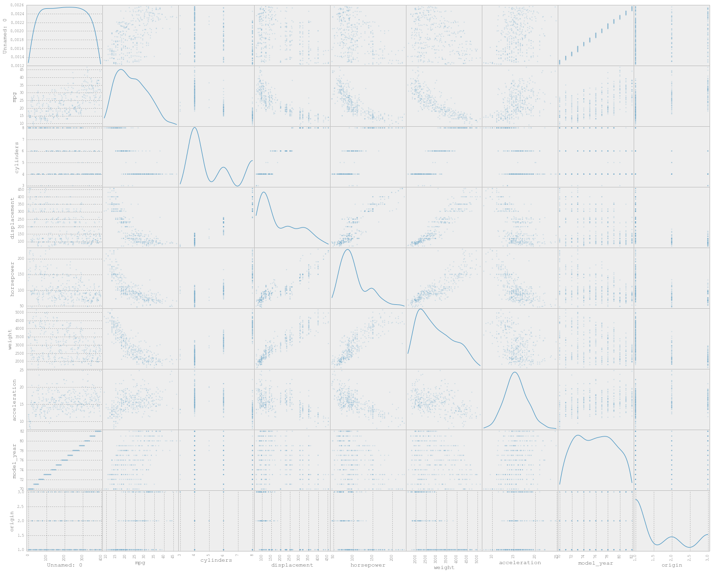


```python
horses = cars['horsepower']
mpg = cars['mpg']
displacement = cars['displacement']
```


```python
plt.scatter(x=horses, y=mpg, alpha=0.4)
plt.xlabel("Horse Power")
plt.ylabel("Miles Per Gallon (MPG)")
plt.savefig("data_scatter.png", dpi=100)
```


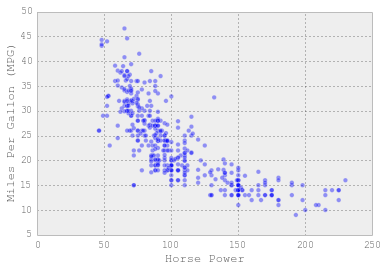


One the one extreme, a linear relationship is underfit; at the other, we see
that including a very large number of polynomial terms is clearly overfitting
the data.


```python
fig, axes = plt.subplots(1, 2, figsize=(14,6))

xvals = np.arange(horses.min(), horses.max())

fit1 = np.polyfit(horses, mpg, 1)
p1 = np.poly1d(fit1)
axes[0].plot(xvals, p1(xvals), color="red", linewidth=2)
axes[0].scatter(x=horses, y=mpg, alpha=0.3)

fit15 = np.polyfit(horses, mpg, 4)
p15 = np.poly1d(fit15)
axes[1].plot(xvals, p15(xvals), color="red", linewidth=2)
axes[1].scatter(x=horses, y=mpg, alpha=0.3)
```


    <matplotlib.collections.PathCollection at 0x1118b1510>


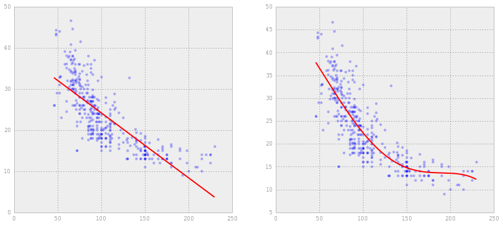


```python
p15.coeffs
```


    array([ -6.53036297e-08,   3.24511548e-05,  -4.34464058e-03,
            -7.66721350e-02,   4.75676772e+01])


```python
p1.coeffs
```


    array([ -0.15784473,  39.93586102])


We can select an appropriate polynomial order for the model using **cross-
validation**, in which we hold out a testing subset from our dataset, fit the
model to the remaining data, and evaluate its performance on the held-out
subset.


```python
from sklearn.cross_validation import train_test_split

xtrain, xtest, ytrain, ytest = train_test_split(horses, mpg, test_size=0.25)
```

A natural criterion to evaluate model performance is root mean square error.


```python
def rmse(x, y, coefs):
    yfit = np.polyval(coefs, x)
    return np.sqrt(np.mean((y - yfit) ** 2))
```

We can now evaluate the model at varying polynomial degrees, and compare their
fit.


```python
# suppress warnings from Polyfit
import warnings
warnings.filterwarnings('ignore', message='Polyfit*')

degrees = np.arange(30)
train_err = np.zeros(len(degrees))
validation_err = np.zeros(len(degrees))

for i, d in enumerate(degrees):
    p = np.polyfit(xtrain, ytrain, d)

    train_err[i] = rmse(xtrain, ytrain, p)
    validation_err[i] = rmse(xtest, ytest, p)

fig, ax = plt.subplots()

ax.plot(degrees, validation_err, lw=2, label = 'cross-validation error')
ax.plot(degrees, train_err, lw=2, label = 'training error')

ax.legend(loc=0)
ax.set_xlabel('degree of fit')
ax.set_ylabel('rms error')
```


    <matplotlib.text.Text at 0x10fc326d0>


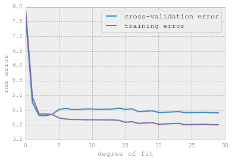


```python
np.argmin(validation_err)
```


    3


```python
def make_data(N=40, error=1.0, random_seed=1):
    # randomly sample the data
    np.random.seed(1)
    X = np.random.random(N)[:, np.newaxis]
    y = test_func(X.ravel(), error)
    
    return X, y

def test_func(x, err=0.5):
    y = 10 - 1. / (x + 0.1)
    if err > 0:
        y = np.random.normal(y, err)
    return y
```


```python
from sklearn.linear_model import LinearRegression

class PolynomialRegression(LinearRegression):
    """Simple Polynomial Regression to 1D data"""
    def __init__(self, degree=1, **kwargs):
        self.degree = degree
        LinearRegression.__init__(self, **kwargs)
        
    def fit(self, X, y):
        if X.shape[1] != 1:
            raise ValueError("Only 1D data valid here")
        Xp = X ** (1 + np.arange(self.degree))
        return LinearRegression.fit(self, Xp, y)
        
    def predict(self, X):
        Xp = X ** (1 + np.arange(self.degree))
        return LinearRegression.predict(self, Xp)
```


```python
from sklearn import metrics

degrees = np.arange(1, 30)

X, y = make_data(100, error=1.0)
X_train, X_test, y_train, y_test = train_test_split(X, y, test_size=0.3)

training_error = []
test_error = []
mse = metrics.mean_squared_error

for d in degrees:
    model = PolynomialRegression(d).fit(X_train, y_train)
    training_error.append(mse(model.predict(X_train), y_train))
    test_error.append(mse(model.predict(X_test), y_test))
    
# note that the test error can also be computed via cross-validation
plt.plot(degrees, training_error, label='training')
plt.plot(degrees, test_error, label='test')
plt.legend()
plt.xlabel('degree')
plt.ylabel('MSE');
plt.savefig("data_error.png", dpi=100)
```

    -c:12: DeprecationWarning: converting an array with ndim > 0 to an index will result in an error in the future
    -c:16: DeprecationWarning: converting an array with ndim > 0 to an index will result in an error in the future
    -c:16: DeprecationWarning: converting an array with ndim > 0 to an index will result in an error in the future


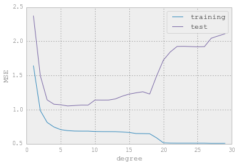


In the cross-validation above, notice that the error is high for both very low
and very high polynomial values, while training error declines monotonically
with degree. The cross-validation error is composed of two components: **bias**
and **variance**. When a model is underfit, bias is low but variance is high,
while when a model is overfit, the reverse is true.

One can show that the MSE decomposes into a sum of the bias (squared) and
variance of the estimator:

<a href="http://www.codecogs.com/eqnedit.php?latex=$$\begin{aligned}&space;\text{Var}(\hat{\theta})&space;&=&space;E[\hat{\theta}&space;-&space;\theta]^2&space;-&space;(E[\hat{\theta}&space;-&space;\theta])^2&space;\&space;\Rightarrow&space;E[\hat{\theta}&space;-&space;\theta]^2&space;&=&space;\text{Var}(\hat{\theta})&space;&plus;&space;\text{Bias}(\hat{\theta})^2&space;\end{aligned}$$" target="_blank"></a>

The training error, on the other hand, does not have this tradeoff; it will
always decrease (or at least, never increase) as variables (polynomial terms)
are added to the model.

## Learning Curves

The exact turning-point of the tradeoff between bias and variance is highly
dependent on the number of training points used.  Here we'll illustrate the use
of *learning curves*, which display this property.

The idea is to plot the mean-squared-error for the training and test set as a
function of *Number of Training Points*


```python
X, y = make_data(200, error=1.0)
degree = 3

X_train, X_test, y_train, y_test = train_test_split(X, y, test_size=0.3)

N_range = np.linspace(15, X_train.shape[0], 20).astype(int)

def plot_learning_curve(degree=3):
    training_error = []
    test_error = []
    mse = metrics.mean_squared_error
    
    for N in N_range:
        XN = X_train[:N]
        yN = y_train[:N]
    
        model = PolynomialRegression(degree).fit(XN, yN)
        training_error.append(mse(model.predict(XN), yN))
        test_error.append(mse(model.predict(X_test), y_test))
      
    plt.plot(N_range, training_error, label='training')
    plt.plot(N_range, test_error, label='test')
    plt.plot(N_range, np.ones_like(N_range), ':k')
    plt.legend()
    plt.title('degree = {0}'.format(degree))
    plt.xlabel('num. training points')
    plt.ylabel('MSE')
    
plot_learning_curve(3)
```


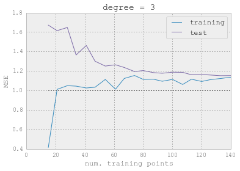


This shows a typical learning curve: for very few training points, there is a
large separation between the training and test error, which indicates **over-
fitting**.  Given the same model, for a large number of training points, the
training and testing errors converge, which indicates potential **under-
fitting**.

It is easy to see that, in this plot, if you'd like to reduce the MSE down to
the nominal value of 1.0 (which is the magnitude of the scatter we put in when
constructing the data), then adding more samples will *Never* get you there.
For $d=3$, we've already converged.  What about for $d=1$?


```python
plot_learning_curve(2)
```


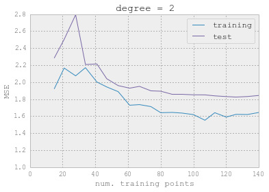


We see that it hasn't converged yet: you still might expect to decrease the test
error by adding more points.

What about the other extreme?


```python
plot_learning_curve(5)
```


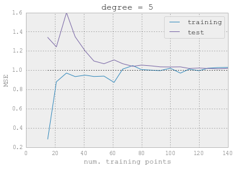


For `d=5`, it's converged, but to a better value than for `d=3`.

Thus you can **bring the two curves closer together** by adding more points, but
you can **bring the convergence level down** only by adding complexity to the
model.

This can be very useful, because it gives you a hint about how to improve upon
results which are sub-par.  To make this more concrete, imagine an astronomy
project in which the results are not robust enough.  You must think about
whether to spend your valuable telescope time observing *more objects* to get a
larger training set, or *more attributes of each object* in order to improve the
model.  The answer to this question is important, and can be addressed using
these metrics.

## K-fold Cross-validation

In **k-fold cross-validation**, the training set is split into *k* smaller sets.
Then, for each of the k "folds":

1. trained model on *k-1* of the folds as training data
2. validate this model the remaining fold, using an appropriate metric

The performance measure reported by k-fold CV is then the average of the *k*
computed values. This approach can be computationally expensive, but does not
waste too much data, which is an advantage over having a fixed test subset.


```python
from sklearn.cross_validation import cross_val_score, KFold

nfolds = 5
fig, axes = plt.subplots(1, nfolds, figsize=(14,4))
for i, fold in enumerate(KFold(len(horses), n_folds=nfolds, 
                               shuffle=True)):
    training, validation = fold
    x, y = horses[training], mpg[training]
    axes[i].plot(x, y, 'ro', alpha=0.7)
    x, y = horses[validation], mpg[validation]
    axes[i].plot(x, y, 'bo', alpha=0.7)
plt.tight_layout()
```


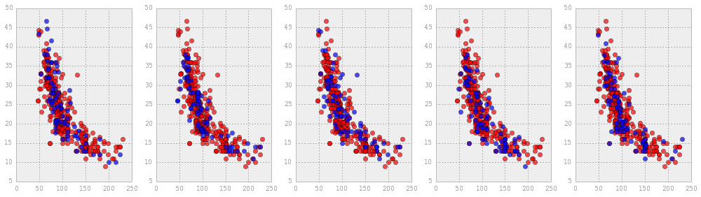


```python
import warnings
warnings.filterwarnings('ignore', message='Polyfit*')

k = 5
degrees = np.arange(16)
k_fold_err = np.empty(len(degrees))

for i, d in enumerate(degrees):
    
    error = np.empty(k)
    
    #for j, fold in enumerate(gen_k_folds(salmon, k)):
    for j, fold in enumerate(KFold(len(horses), n_folds=k)):

        training, validation = fold
        
        x_train, y_train = horses[training], mpg[training]
   
        x_test, y_test = horses[validation], mpg[validation]
            
        p = np.polyfit(x_train, y_train, d)
        
        error[j] = rmse(x_test, y_test, p)

    k_fold_err[i] = error.mean()
        

fig, ax = plt.subplots()

ax.plot(degrees, k_fold_err, lw=2)
ax.set_xlabel('degree of fit')
ax.set_ylabel('average rms error')
```


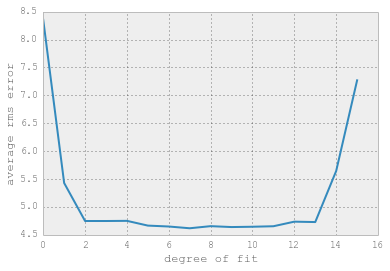


```python
np.argmin(k_fold_err)
```


    7


If the model shows high **bias**, the following actions might help:

- **Add more features**. In our example of predicting home prices,
  it may be helpful to make use of information such as the neighborhood
  the house is in, the year the house was built, the size of the lot, etc.
  Adding these features to the training and test sets can improve
  a high-bias estimator
- **Use a more sophisticated model**. Adding complexity to the model can
  help improve on bias. For a polynomial fit, this can be accomplished
  by increasing the degree d. Each learning technique has its own
  methods of adding complexity.
- **Decrease regularization**. Regularization is a technique used to impose
  simplicity in some machine learning models, by adding a penalty term that
  depends on the characteristics of the parameters. If a model has high bias,
  decreasing the effect of regularization can lead to better results.

If the model shows **high variance**, the following actions might help:

- **Use fewer features**. Using a feature selection technique may be
  useful, and decrease the over-fitting of the estimator.
- **Use a simpler model**.  Model complexity and over-fitting go hand-in-hand.
- **Use more training samples**. Adding training samples can reduce
  the effect of over-fitting, and lead to improvements in a high
  variance estimator.
- **Increase regularization**. Regularization is designed to prevent
  over-fitting. In a high-variance model, increasing regularization
  can lead to better results.

## Regularization

We will be using a dataset of prostrate cancer occurances.


```python
from sklearn import datasets

diabetes = datasets.load_diabetes()
prostrate = pd.read_table("data/prostrate.data").iloc[:,1:]
```


```python
prostrate.head()
```


<div style="max-height:1000px;max-width:1500px;overflow:auto;">
<table border="1" class="dataframe">
  <thead>
    <tr style="text-align: right;">
      <th></th>
      <th>lcavol</th>
      <th>lweight</th>
      <th>age</th>
      <th>lbph</th>
      <th>svi</th>
      <th>lcp</th>
      <th>gleason</th>
      <th>pgg45</th>
      <th>lpsa</th>
      <th>train</th>
    </tr>
  </thead>
  <tbody>
    <tr>
      <th>0</th>
      <td>-0.579818</td>
      <td> 2.769459</td>
      <td> 50</td>
      <td>-1.386294</td>
      <td> 0</td>
      <td>-1.386294</td>
      <td> 6</td>
      <td>  0</td>
      <td>-0.430783</td>
      <td> T</td>
    </tr>
    <tr>
      <th>1</th>
      <td>-0.994252</td>
      <td> 3.319626</td>
      <td> 58</td>
      <td>-1.386294</td>
      <td> 0</td>
      <td>-1.386294</td>
      <td> 6</td>
      <td>  0</td>
      <td>-0.162519</td>
      <td> T</td>
    </tr>
    <tr>
      <th>2</th>
      <td>-0.510826</td>
      <td> 2.691243</td>
      <td> 74</td>
      <td>-1.386294</td>
      <td> 0</td>
      <td>-1.386294</td>
      <td> 7</td>
      <td> 20</td>
      <td>-0.162519</td>
      <td> T</td>
    </tr>
    <tr>
      <th>3</th>
      <td>-1.203973</td>
      <td> 3.282789</td>
      <td> 58</td>
      <td>-1.386294</td>
      <td> 0</td>
      <td>-1.386294</td>
      <td> 6</td>
      <td>  0</td>
      <td>-0.162519</td>
      <td> T</td>
    </tr>
    <tr>
      <th>4</th>
      <td> 0.751416</td>
      <td> 3.432373</td>
      <td> 62</td>
      <td>-1.386294</td>
      <td> 0</td>
      <td>-1.386294</td>
      <td> 6</td>
      <td>  0</td>
      <td> 0.371564</td>
      <td> T</td>
    </tr>
  </tbody>
</table>
<p>5 rows × 10 columns</p>
</div>


```python
training = prostrate[prostrate.train=="T"]
```


```python
testing = prostrate[prostrate.train=="F"]
```


```python
len(testing)
```


    30


```python
len(training)
```


    67


```python
prostrate.head()
```


<div style="max-height:1000px;max-width:1500px;overflow:auto;">
<table border="1" class="dataframe">
  <thead>
    <tr style="text-align: right;">
      <th></th>
      <th>lcavol</th>
      <th>lweight</th>
      <th>age</th>
      <th>lbph</th>
      <th>svi</th>
      <th>lcp</th>
      <th>gleason</th>
      <th>pgg45</th>
      <th>lpsa</th>
      <th>train</th>
    </tr>
  </thead>
  <tbody>
    <tr>
      <th>0</th>
      <td>-0.579818</td>
      <td> 2.769459</td>
      <td> 50</td>
      <td>-1.386294</td>
      <td> 0</td>
      <td>-1.386294</td>
      <td> 6</td>
      <td>  0</td>
      <td>-0.430783</td>
      <td> T</td>
    </tr>
    <tr>
      <th>1</th>
      <td>-0.994252</td>
      <td> 3.319626</td>
      <td> 58</td>
      <td>-1.386294</td>
      <td> 0</td>
      <td>-1.386294</td>
      <td> 6</td>
      <td>  0</td>
      <td>-0.162519</td>
      <td> T</td>
    </tr>
    <tr>
      <th>2</th>
      <td>-0.510826</td>
      <td> 2.691243</td>
      <td> 74</td>
      <td>-1.386294</td>
      <td> 0</td>
      <td>-1.386294</td>
      <td> 7</td>
      <td> 20</td>
      <td>-0.162519</td>
      <td> T</td>
    </tr>
    <tr>
      <th>3</th>
      <td>-1.203973</td>
      <td> 3.282789</td>
      <td> 58</td>
      <td>-1.386294</td>
      <td> 0</td>
      <td>-1.386294</td>
      <td> 6</td>
      <td>  0</td>
      <td>-0.162519</td>
      <td> T</td>
    </tr>
    <tr>
      <th>4</th>
      <td> 0.751416</td>
      <td> 3.432373</td>
      <td> 62</td>
      <td>-1.386294</td>
      <td> 0</td>
      <td>-1.386294</td>
      <td> 6</td>
      <td>  0</td>
      <td> 0.371564</td>
      <td> T</td>
    </tr>
  </tbody>
</table>
<p>5 rows × 10 columns</p>
</div>


Let's examine how a linear regression model performs across a range of sample
sizes.


```python
prostrate.iloc[:,:-2]
```


<div style="max-height:1000px;max-width:1500px;overflow:auto;">
<table border="1" class="dataframe">
  <thead>
    <tr style="text-align: right;">
      <th></th>
      <th>lcavol</th>
      <th>lweight</th>
      <th>age</th>
      <th>lbph</th>
      <th>svi</th>
      <th>lcp</th>
      <th>gleason</th>
      <th>pgg45</th>
    </tr>
  </thead>
  <tbody>
    <tr>
      <th>0 </th>
      <td>-0.579818</td>
      <td> 2.769459</td>
      <td> 50</td>
      <td>-1.386294</td>
      <td> 0</td>
      <td>-1.386294</td>
      <td> 6</td>
      <td>   0</td>
    </tr>
    <tr>
      <th>1 </th>
      <td>-0.994252</td>
      <td> 3.319626</td>
      <td> 58</td>
      <td>-1.386294</td>
      <td> 0</td>
      <td>-1.386294</td>
      <td> 6</td>
      <td>   0</td>
    </tr>
    <tr>
      <th>2 </th>
      <td>-0.510826</td>
      <td> 2.691243</td>
      <td> 74</td>
      <td>-1.386294</td>
      <td> 0</td>
      <td>-1.386294</td>
      <td> 7</td>
      <td>  20</td>
    </tr>
    <tr>
      <th>3 </th>
      <td>-1.203973</td>
      <td> 3.282789</td>
      <td> 58</td>
      <td>-1.386294</td>
      <td> 0</td>
      <td>-1.386294</td>
      <td> 6</td>
      <td>   0</td>
    </tr>
    <tr>
      <th>4 </th>
      <td> 0.751416</td>
      <td> 3.432373</td>
      <td> 62</td>
      <td>-1.386294</td>
      <td> 0</td>
      <td>-1.386294</td>
      <td> 6</td>
      <td>   0</td>
    </tr>
    <tr>
      <th>5 </th>
      <td>-1.049822</td>
      <td> 3.228826</td>
      <td> 50</td>
      <td>-1.386294</td>
      <td> 0</td>
      <td>-1.386294</td>
      <td> 6</td>
      <td>   0</td>
    </tr>
    <tr>
      <th>6 </th>
      <td> 0.737164</td>
      <td> 3.473518</td>
      <td> 64</td>
      <td> 0.615186</td>
      <td> 0</td>
      <td>-1.386294</td>
      <td> 6</td>
      <td>   0</td>
    </tr>
    <tr>
      <th>7 </th>
      <td> 0.693147</td>
      <td> 3.539509</td>
      <td> 58</td>
      <td> 1.536867</td>
      <td> 0</td>
      <td>-1.386294</td>
      <td> 6</td>
      <td>   0</td>
    </tr>
    <tr>
      <th>8 </th>
      <td>-0.776529</td>
      <td> 3.539509</td>
      <td> 47</td>
      <td>-1.386294</td>
      <td> 0</td>
      <td>-1.386294</td>
      <td> 6</td>
      <td>   0</td>
    </tr>
    <tr>
      <th>9 </th>
      <td> 0.223144</td>
      <td> 3.244544</td>
      <td> 63</td>
      <td>-1.386294</td>
      <td> 0</td>
      <td>-1.386294</td>
      <td> 6</td>
      <td>   0</td>
    </tr>
    <tr>
      <th>10</th>
      <td> 0.254642</td>
      <td> 3.604138</td>
      <td> 65</td>
      <td>-1.386294</td>
      <td> 0</td>
      <td>-1.386294</td>
      <td> 6</td>
      <td>   0</td>
    </tr>
    <tr>
      <th>11</th>
      <td>-1.347074</td>
      <td> 3.598681</td>
      <td> 63</td>
      <td> 1.266948</td>
      <td> 0</td>
      <td>-1.386294</td>
      <td> 6</td>
      <td>   0</td>
    </tr>
    <tr>
      <th>12</th>
      <td> 1.613430</td>
      <td> 3.022861</td>
      <td> 63</td>
      <td>-1.386294</td>
      <td> 0</td>
      <td>-0.597837</td>
      <td> 7</td>
      <td>  30</td>
    </tr>
    <tr>
      <th>13</th>
      <td> 1.477049</td>
      <td> 2.998229</td>
      <td> 67</td>
      <td>-1.386294</td>
      <td> 0</td>
      <td>-1.386294</td>
      <td> 7</td>
      <td>   5</td>
    </tr>
    <tr>
      <th>14</th>
      <td> 1.205971</td>
      <td> 3.442019</td>
      <td> 57</td>
      <td>-1.386294</td>
      <td> 0</td>
      <td>-0.430783</td>
      <td> 7</td>
      <td>   5</td>
    </tr>
    <tr>
      <th>15</th>
      <td> 1.541159</td>
      <td> 3.061052</td>
      <td> 66</td>
      <td>-1.386294</td>
      <td> 0</td>
      <td>-1.386294</td>
      <td> 6</td>
      <td>   0</td>
    </tr>
    <tr>
      <th>16</th>
      <td>-0.415515</td>
      <td> 3.516013</td>
      <td> 70</td>
      <td> 1.244155</td>
      <td> 0</td>
      <td>-0.597837</td>
      <td> 7</td>
      <td>  30</td>
    </tr>
    <tr>
      <th>17</th>
      <td> 2.288486</td>
      <td> 3.649359</td>
      <td> 66</td>
      <td>-1.386294</td>
      <td> 0</td>
      <td> 0.371564</td>
      <td> 6</td>
      <td>   0</td>
    </tr>
    <tr>
      <th>18</th>
      <td>-0.562119</td>
      <td> 3.267666</td>
      <td> 41</td>
      <td>-1.386294</td>
      <td> 0</td>
      <td>-1.386294</td>
      <td> 6</td>
      <td>   0</td>
    </tr>
    <tr>
      <th>19</th>
      <td> 0.182322</td>
      <td> 3.825375</td>
      <td> 70</td>
      <td> 1.658228</td>
      <td> 0</td>
      <td>-1.386294</td>
      <td> 6</td>
      <td>   0</td>
    </tr>
    <tr>
      <th>20</th>
      <td> 1.147402</td>
      <td> 3.419365</td>
      <td> 59</td>
      <td>-1.386294</td>
      <td> 0</td>
      <td>-1.386294</td>
      <td> 6</td>
      <td>   0</td>
    </tr>
    <tr>
      <th>21</th>
      <td> 2.059239</td>
      <td> 3.501043</td>
      <td> 60</td>
      <td> 1.474763</td>
      <td> 0</td>
      <td> 1.348073</td>
      <td> 7</td>
      <td>  20</td>
    </tr>
    <tr>
      <th>22</th>
      <td>-0.544727</td>
      <td> 3.375880</td>
      <td> 59</td>
      <td>-0.798508</td>
      <td> 0</td>
      <td>-1.386294</td>
      <td> 6</td>
      <td>   0</td>
    </tr>
    <tr>
      <th>23</th>
      <td> 1.781709</td>
      <td> 3.451574</td>
      <td> 63</td>
      <td> 0.438255</td>
      <td> 0</td>
      <td> 1.178655</td>
      <td> 7</td>
      <td>  60</td>
    </tr>
    <tr>
      <th>24</th>
      <td> 0.385262</td>
      <td> 3.667400</td>
      <td> 69</td>
      <td> 1.599388</td>
      <td> 0</td>
      <td>-1.386294</td>
      <td> 6</td>
      <td>   0</td>
    </tr>
    <tr>
      <th>25</th>
      <td> 1.446919</td>
      <td> 3.124565</td>
      <td> 68</td>
      <td> 0.300105</td>
      <td> 0</td>
      <td>-1.386294</td>
      <td> 6</td>
      <td>   0</td>
    </tr>
    <tr>
      <th>26</th>
      <td> 0.512824</td>
      <td> 3.719651</td>
      <td> 65</td>
      <td>-1.386294</td>
      <td> 0</td>
      <td>-0.798508</td>
      <td> 7</td>
      <td>  70</td>
    </tr>
    <tr>
      <th>27</th>
      <td>-0.400478</td>
      <td> 3.865979</td>
      <td> 67</td>
      <td> 1.816452</td>
      <td> 0</td>
      <td>-1.386294</td>
      <td> 7</td>
      <td>  20</td>
    </tr>
    <tr>
      <th>28</th>
      <td> 1.040277</td>
      <td> 3.128951</td>
      <td> 67</td>
      <td> 0.223144</td>
      <td> 0</td>
      <td> 0.048790</td>
      <td> 7</td>
      <td>  80</td>
    </tr>
    <tr>
      <th>29</th>
      <td> 2.409644</td>
      <td> 3.375880</td>
      <td> 65</td>
      <td>-1.386294</td>
      <td> 0</td>
      <td> 1.619388</td>
      <td> 6</td>
      <td>   0</td>
    </tr>
    <tr>
      <th>30</th>
      <td> 0.285179</td>
      <td> 4.090169</td>
      <td> 65</td>
      <td> 1.962908</td>
      <td> 0</td>
      <td>-0.798508</td>
      <td> 6</td>
      <td>   0</td>
    </tr>
    <tr>
      <th>31</th>
      <td> 0.182322</td>
      <td> 3.804438</td>
      <td> 65</td>
      <td> 1.704748</td>
      <td> 0</td>
      <td>-1.386294</td>
      <td> 6</td>
      <td>   0</td>
    </tr>
    <tr>
      <th>32</th>
      <td> 1.275363</td>
      <td> 3.037354</td>
      <td> 71</td>
      <td> 1.266948</td>
      <td> 0</td>
      <td>-1.386294</td>
      <td> 6</td>
      <td>   0</td>
    </tr>
    <tr>
      <th>33</th>
      <td> 0.009950</td>
      <td> 3.267666</td>
      <td> 54</td>
      <td>-1.386294</td>
      <td> 0</td>
      <td>-1.386294</td>
      <td> 6</td>
      <td>   0</td>
    </tr>
    <tr>
      <th>34</th>
      <td>-0.010050</td>
      <td> 3.216874</td>
      <td> 63</td>
      <td>-1.386294</td>
      <td> 0</td>
      <td>-0.798508</td>
      <td> 6</td>
      <td>   0</td>
    </tr>
    <tr>
      <th>35</th>
      <td> 1.308333</td>
      <td> 4.119850</td>
      <td> 64</td>
      <td> 2.171337</td>
      <td> 0</td>
      <td>-1.386294</td>
      <td> 7</td>
      <td>   5</td>
    </tr>
    <tr>
      <th>36</th>
      <td> 1.423108</td>
      <td> 3.657131</td>
      <td> 73</td>
      <td>-0.579819</td>
      <td> 0</td>
      <td> 1.658228</td>
      <td> 8</td>
      <td>  15</td>
    </tr>
    <tr>
      <th>37</th>
      <td> 0.457425</td>
      <td> 2.374906</td>
      <td> 64</td>
      <td>-1.386294</td>
      <td> 0</td>
      <td>-1.386294</td>
      <td> 7</td>
      <td>  15</td>
    </tr>
    <tr>
      <th>38</th>
      <td> 2.660959</td>
      <td> 4.085136</td>
      <td> 68</td>
      <td> 1.373716</td>
      <td> 1</td>
      <td> 1.832581</td>
      <td> 7</td>
      <td>  35</td>
    </tr>
    <tr>
      <th>39</th>
      <td> 0.797507</td>
      <td> 3.013081</td>
      <td> 56</td>
      <td> 0.936093</td>
      <td> 0</td>
      <td>-0.162519</td>
      <td> 7</td>
      <td>   5</td>
    </tr>
    <tr>
      <th>40</th>
      <td> 0.620576</td>
      <td> 3.141995</td>
      <td> 60</td>
      <td>-1.386294</td>
      <td> 0</td>
      <td>-1.386294</td>
      <td> 9</td>
      <td>  80</td>
    </tr>
    <tr>
      <th>41</th>
      <td> 1.442202</td>
      <td> 3.682610</td>
      <td> 68</td>
      <td>-1.386294</td>
      <td> 0</td>
      <td>-1.386294</td>
      <td> 7</td>
      <td>  10</td>
    </tr>
    <tr>
      <th>42</th>
      <td> 0.582216</td>
      <td> 3.865979</td>
      <td> 62</td>
      <td> 1.713798</td>
      <td> 0</td>
      <td>-0.430783</td>
      <td> 6</td>
      <td>   0</td>
    </tr>
    <tr>
      <th>43</th>
      <td> 1.771557</td>
      <td> 3.896909</td>
      <td> 61</td>
      <td>-1.386294</td>
      <td> 0</td>
      <td> 0.810930</td>
      <td> 7</td>
      <td>   6</td>
    </tr>
    <tr>
      <th>44</th>
      <td> 1.486140</td>
      <td> 3.409496</td>
      <td> 66</td>
      <td> 1.749200</td>
      <td> 0</td>
      <td>-0.430783</td>
      <td> 7</td>
      <td>  20</td>
    </tr>
    <tr>
      <th>45</th>
      <td> 1.663926</td>
      <td> 3.392829</td>
      <td> 61</td>
      <td> 0.615186</td>
      <td> 0</td>
      <td>-1.386294</td>
      <td> 7</td>
      <td>  15</td>
    </tr>
    <tr>
      <th>46</th>
      <td> 2.727853</td>
      <td> 3.995445</td>
      <td> 79</td>
      <td> 1.879465</td>
      <td> 1</td>
      <td> 2.656757</td>
      <td> 9</td>
      <td> 100</td>
    </tr>
    <tr>
      <th>47</th>
      <td> 1.163151</td>
      <td> 4.035125</td>
      <td> 68</td>
      <td> 1.713798</td>
      <td> 0</td>
      <td>-0.430783</td>
      <td> 7</td>
      <td>  40</td>
    </tr>
    <tr>
      <th>48</th>
      <td> 1.745716</td>
      <td> 3.498022</td>
      <td> 43</td>
      <td>-1.386294</td>
      <td> 0</td>
      <td>-1.386294</td>
      <td> 6</td>
      <td>   0</td>
    </tr>
    <tr>
      <th>49</th>
      <td> 1.220830</td>
      <td> 3.568123</td>
      <td> 70</td>
      <td> 1.373716</td>
      <td> 0</td>
      <td>-0.798508</td>
      <td> 6</td>
      <td>   0</td>
    </tr>
    <tr>
      <th>50</th>
      <td> 1.091923</td>
      <td> 3.993603</td>
      <td> 68</td>
      <td>-1.386294</td>
      <td> 0</td>
      <td>-1.386294</td>
      <td> 7</td>
      <td>  50</td>
    </tr>
    <tr>
      <th>51</th>
      <td> 1.660131</td>
      <td> 4.234831</td>
      <td> 64</td>
      <td> 2.073172</td>
      <td> 0</td>
      <td>-1.386294</td>
      <td> 6</td>
      <td>   0</td>
    </tr>
    <tr>
      <th>52</th>
      <td> 0.512824</td>
      <td> 3.633631</td>
      <td> 64</td>
      <td> 1.492904</td>
      <td> 0</td>
      <td> 0.048790</td>
      <td> 7</td>
      <td>  70</td>
    </tr>
    <tr>
      <th>53</th>
      <td> 2.127041</td>
      <td> 4.121473</td>
      <td> 68</td>
      <td> 1.766442</td>
      <td> 0</td>
      <td> 1.446919</td>
      <td> 7</td>
      <td>  40</td>
    </tr>
    <tr>
      <th>54</th>
      <td> 3.153590</td>
      <td> 3.516013</td>
      <td> 59</td>
      <td>-1.386294</td>
      <td> 0</td>
      <td>-1.386294</td>
      <td> 7</td>
      <td>   5</td>
    </tr>
    <tr>
      <th>55</th>
      <td> 1.266948</td>
      <td> 4.280132</td>
      <td> 66</td>
      <td> 2.122262</td>
      <td> 0</td>
      <td>-1.386294</td>
      <td> 7</td>
      <td>  15</td>
    </tr>
    <tr>
      <th>56</th>
      <td> 0.974560</td>
      <td> 2.865054</td>
      <td> 47</td>
      <td>-1.386294</td>
      <td> 0</td>
      <td> 0.500775</td>
      <td> 7</td>
      <td>   4</td>
    </tr>
    <tr>
      <th>57</th>
      <td> 0.463734</td>
      <td> 3.764682</td>
      <td> 49</td>
      <td> 1.423108</td>
      <td> 0</td>
      <td>-1.386294</td>
      <td> 6</td>
      <td>   0</td>
    </tr>
    <tr>
      <th>58</th>
      <td> 0.542324</td>
      <td> 4.178226</td>
      <td> 70</td>
      <td> 0.438255</td>
      <td> 0</td>
      <td>-1.386294</td>
      <td> 7</td>
      <td>  20</td>
    </tr>
    <tr>
      <th>59</th>
      <td> 1.061257</td>
      <td> 3.851211</td>
      <td> 61</td>
      <td> 1.294727</td>
      <td> 0</td>
      <td>-1.386294</td>
      <td> 7</td>
      <td>  40</td>
    </tr>
    <tr>
      <th></th>
      <td>...</td>
      <td>...</td>
      <td>...</td>
      <td>...</td>
      <td>...</td>
      <td>...</td>
      <td>...</td>
      <td>...</td>
    </tr>
  </tbody>
</table>
<p>97 rows × 8 columns</p>
</div>


```python
X_d = prostrate.iloc[:,:-2]
y_d = prostrate.iloc[:,-2]

ytrain, ytest = y_d[0:50], y_d[50:]
Xtrain, Xtest = X_d[0:50], X_d[50:]
```

The estimator for the ridge regression model is:

$$\hat{\beta}^{ridge} = (X'X + \alpha I)^{-1}X'y$$


```python
def ridge(X, y, d2):
    return dot(dot(inv(dot(X.T, X) + d2*eye(X.shape[1])), X.T), y)
```


```python
from sklearn import preprocessing
from sklearn import linear_model

k = diabetes['data'].shape[1]
alphas = np.linspace(0, 4)
params = np.zeros((len(alphas), k))
for i,a in enumerate(alphas):
    X = preprocessing.scale(diabetes['data'])
    y = diabetes['target']
    fit = linear_model.Lasso(alpha=a, normalize=True).fit(X, y)
    params[i] = fit.coef_

figure(figsize=(14,6))
for param in params.T:
    plt.plot(alphas, param)
```

    -c:10: UserWarning: With alpha=0, this algorithm does not converge well. You are advised to use the LinearRegression estimator
    /Users/jonathandinu/anaconda/lib/python2.7/site-packages/sklearn/linear_model/coordinate_descent.py:413: UserWarning: Coordinate descent with alpha=0 may lead to unexpected results and is discouraged.
      coef_, l1_reg, l2_reg, X, y, max_iter, tol, positive)
    /Users/jonathandinu/anaconda/lib/python2.7/site-packages/sklearn/linear_model/coordinate_descent.py:418: UserWarning: Objective did not converge. You might want to increase the number of iterations
      ' to increase the number of iterations')


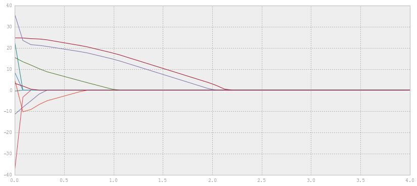


```python
d2range = logspace(-1.5, 3.5, num=20)
thetas = array([ridge(Xtrain, ytrain, d2) for d2 in d2range])
figure(figsize=(6,6))
xscale('log')
grid()
xlabel(r'$\alpha$'); ylabel(r'$\theta$')
plot(d2range, thetas)
legend(prostrate.columns)
show()
```


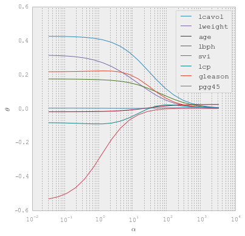


