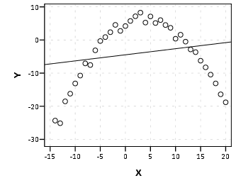

1. [Regression with sklearn](#regression-with-sklearn)
1. [Fitting a polynomial](#fitting-a-polynomial)

## Regression with sklearn

There are several good modules with implementations of regression. We've
used
[statsmodels](http://statsmodels.sourceforge.net/devel/generated/statsmodels.regression.linear_model.OLS.html).
Today we will be using [sklearn](http://scikit-learn.org/stable/modules/generated/sklearn.linear_model.LinearRegression.html).
[numpy](docs.­scipy.­org/­doc/­numpy/­reference/­generated/­numpy.­polyfit.­html) and
[scipy](http://docs.scipy.org/doc/scipy-0.13.0/reference/generated/scipy.stats.linregress.html)
also have implmentations.

Resources:
* [sklearn documentation](http://scikit-learn.org/stable/modules/generated/sklearn.linear_model.LinearRegression.html)
* [sklearn example](http://scikit-learn.org/0.11/auto_examples/linear_model/plot_ols.html)

For all `sklearn` modules, the `fit` method is used to train and the `score`
method is used to test. You can also use the `predict` method to see the
predicted y values.

#### Example

This is the general workflow for working with sklearn. Any algorithm we use from sklearn will have the same form.

```python
import pandas as pd
from sklearn.linear_model import LinearRegression
from sklearn.cross_validation import train_test_split

# Load data from csv file
df = pd.read_csv('data/housing_prices.csv')
X = df[['square_feet', 'num_rooms']].values
y = df['price'].values

# Split into training and test sets
X_train, X_test, y_train, y_test = train_test_split(X, y, test_size=0.15)

# Run Linear Regression
regr = LinearRegression()
regr.fit(X_train, y_train)
print "Intercept:", regr.intercept_
print "Coefficients:", regr.coef_
print "R^2 error:", regr.score(X_test, y_test)
predicted_y = regr.predict(X_test)
```

 `LinearRegression` is a class and you have to create an instance of it. If there are any parameters to the model, you should set them when you instantiate the object. For example, with `LinearRegression`, you can choose whether to normalize you data:

 ```python
 regr = LinearRegression(normalize=True)    # the default is False
 ```

You should call the `fit` method once. Here you give it the training data and it will train your model. Once you have that, you can get the coefficients for the equation (`intercept_` and `coef_`) and also get the score for your test set (`score` method). You can also get the predicted values for any new data you would like to give to the model (`predict` method).

Here's an example using kfold:

```python
from sklearn import cross_validation
kf = cross_validation.KFold(X.shape[0], n_folds=5, shuffle=True)
results = []
for train_index, test_index in kf:
    regr = LinearRegression()
    regr.fit(X[train_index], y[train_index])
    results.append(regr.score(X[test_index], y[test_index]))
print "average score:", np.mean(results)
```


## Fitting a polynomial

Oftentimes you'll notice that you're data isn't linear and that really you should be fitting a higher degree polynomial to the line. This is called *underfitting*, which we'll get to later.



So how do we do this? We can use the same algorithm, we just need to modify our features. Let's look at the one feature world for a minute. We have data that looks something like this:

|     x |     y |
| ----- | ----- |
|     3 |     8 |
|     4 |    17 |
|     7 |    40 |
|     9 |    78 |
|    11 |   109 |

 For linear regression, we are trying to find the `b` and `c` that minimize the error in the following equation:

    bx + c = y

To do a *quadratic* regression instead of a *linear* regression, we instead want to find the optimal `a`, `b` and `c` in this equation:

    ax^2 + bx + c = y

We can just add a new feature to our feature matrix by computing `x^2`:

|     x |   x^2 |    y |
| ----- | ----- | ----- |
|     3 |     9 |     8 |
|     4 |    16 |    17 |
|     7 |    49 |    40 |
|     9 |    81 |    78 |
|    11 |   121 |   109 |

Now you can do linear regression with these features. If there's a linear relationship between `x^2` and `y` that means there's a quadratic relationship between `x` and `y`.

If you have more than one feature, you need to do all the combinations. If you start with two features, `x` and `z`, to do the order 2 polynomial, you will need to add these features: `x^2`, `z^2`, `xz`.

In `sklearn`, you should use `PolynomialFeatures` for generating these additional features ([documentation](http://scikit-learn.org/stable/modules/generated/sklearn.preprocessing.PolynomialFeatures.html#sklearn.preprocessing.PolynomialFeatures)). Here's how you would modify the above example to include polynomial features up to degree 3:

```python
import pandas as pd
from sklearn.preprocessing import PolynomialFeatures
from sklearn.linear_model import LinearRegression
from sklearn.cross_validation import train_test_split

# Load data is identical as above
df = pd.read_csv('data/housing_prices.csv')
X = df[['square_feet', 'num_rooms']]
y = df['price']

# Add the polynomial features
poly = PolynomialFeatures(3)
X_new = poly.fit_transform(X)

# Split into training and test sets
X_train, X_test, y_train, y_test = train_test_split(X_new, y, test_size=0.15)

# Run Linear Regression (the same as above)
regr = LinearRegression()
regr.fit(X_train, y_train)
print "Intercept:", regr.intercept_
print "Coefficients:", regr.coef_
print "R^2 error:", regr.score(X_test, y_test)
predicted_y = regr.predict(X_test)
```

Here's sklearn's [example](http://scikit-learn.org/stable/auto_examples/linear_model/plot_polynomial_interpolation.html). They use a `pipeline` to make the code a little simpler (with the same functionality).

In `numpy`, you can use the `polyfit` function ([documentation](http://docs.scipy.org/doc/numpy/reference/generated/numpy.polyfit.html)).

The discussion below will give insight into how to determine which degree of polynomial to pick.
